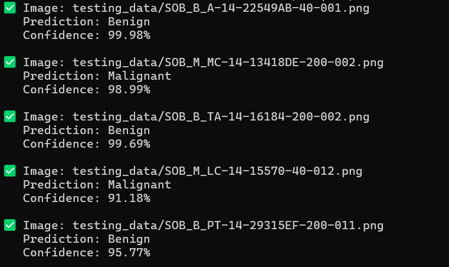

🧠 Breast Cancer Detection Using Deep Transfer Learning
This project implements a dual-branch deep learning model that analyzes both histopathological and thermal images to detect breast cancer. It combines two powerful image modalities for enhanced diagnostic accuracy, aiding in early and reliable cancer detection.

🚀 Features
🔬 Dual-branch CNN architecture

🧪 Support for both thermal and histopathological images

📈 Training and validation visualization

📊 Confusion matrix to evaluate classification performance

✅ Trained on the BreaKHis dataset and preprocessed thermal images

🧠 Uses PyTorch for deep learning and training

📂 Project Structure
bash
Copy
Edit
├── data/
│   ├── raw/                   # Raw histopathological images
│   └── thermal/               # Converted thermal images
│
├── src/                       # Source code for dataset, models, training
│   ├── model.py
│   ├── train.py
│   ├── test.py
│   └── ...
│
├── outputs/                   # Sample output predictions
├── confusion matrix/         # Confusion matrices (new and old)
├── training curves/          # Training curve plots (new and old)
├── dual_branch_cnn.pth       # Trained model (latest)
├── dual_branch_cnn1.pth      # Backup model
├── training_history.pkl      # Training history (new)
├── training_history_old.pkl  # Old training history
├── requirements.txt          # Required Python packages
└── README.md
📦 Requirements
Python 3.8+

PyTorch

NumPy

Matplotlib

scikit-learn

OpenCV

tqdm

Install dependencies:

bash
Copy
Edit
pip install -r requirements.txt
🏁 Getting Started
Clone the repository:

bash
Copy
Edit
git clone https://github.com/hrveekshith/Breast_cancer_detection_using_deep_tranfer_learning.git
cd Breast_cancer_detection_using_deep_tranfer_learning
Prepare the dataset:

Download the BreaKHis dataset: BreaKHis Dataset (4GB)

Place the histopathological and thermal images inside the data/raw/ and data/thermal/ folders respectively.

Train the model:

bash
Copy
Edit
python src/train.py
Evaluate the model:

bash
Copy
Edit
python src/test.py
📌 Visualizations
📈 Training Curve

📊 Confusion Matrix

📸 Output Sample

📚 Research Context
This project is a research-oriented implementation exploring how multimodal learning (histopathology + thermal imaging) can enhance the detection of malignant vs benign breast cancer cases. The project reflects a combination of transfer learning, image preprocessing, and model fusion techniques.

🤝 Contributing
Pull requests are welcome! If you discover bugs or have ideas for improvement, feel free to open an issue or submit a PR.

📄 License
This project is licensed under the MIT License — see the LICENSE file for details.

🙋‍♂️ Author
Veekshith Gowda H R
🔗 GitHub Profile
